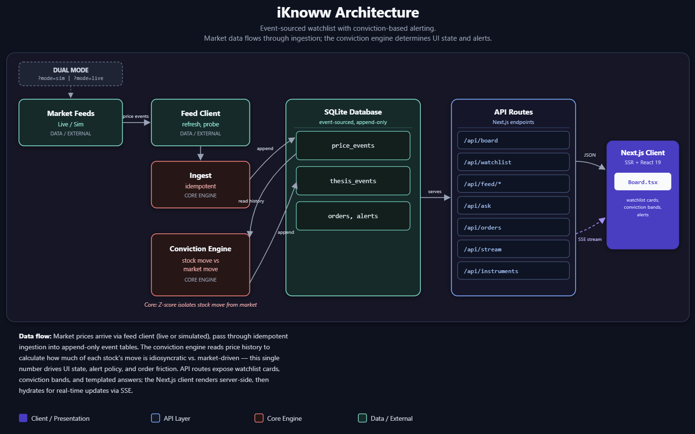

# iKnoww

*"I know" — with Groww's two w's.*

A watchlist that knows **why** you are watching, and tells you when your trigger fired for the
wrong reason.

Most watchlists tell you a price moved. This one asks whether the move was about your stock at all.
Every item carries a thesis. When it triggers, the move is split against the market: if 93% of it was
the index, the card says *"this is not your dip"* and we send you nothing.



**Live: <https://iknoww-3kxc.onrender.com/>**

> Hosted on a free instance, which sleeps after about fifteen minutes idle. **The first request
> after that takes roughly 30 to 50 seconds to wake.** Every request after it is fast. If you are
> about to demo it, open the link a minute beforehand.

Built for **Code, by Groww (CODE 2026)**. iKnoww is an independent hackathon entry and is not
affiliated with Groww; its colours follow Groww's published design tokens as a deliberate choice,
documented in [`docs/DESIGN.md`](docs/DESIGN.md).

---

## Run it

Requires **Node 20.11 or newer**. Nothing else — no database to install, no `.env` to create.

```bash
npm install
npm run dev
```

Open <http://localhost:3000>. On first run the app seeds twelve instruments, generates 300 days of
price history, and puts nine theses across two watchlists so there is something to look at.

```bash
npm test        # 417 tests
npm run build   # production build
```

The app opens in **Simulated data** mode — self-contained, no network needed. **Live feed** switches
to real NSE prices (delayed ~15 minutes) and starts empty. **There is no `.env` file, and the app
must never need one.**

---

## See the point in thirty seconds

The scenario buttons are on the main screen, because the interesting behaviour needs a market event
to exist at all:

| Button | What to watch for |
|---|---|
| **Market crash** | Everything turns red and **the triggers that fire are sent to review, not to action** — "this is not your dip," "you would be selling the market, not exiting your thesis" |
| **Single-stock shock** | One stock moves alone while the market sits still — the one that would earn a notification |
| **Bad tick, then a correction** | A wrong price moves a card; the correction rolls it back and **retracts the alert** that was already sent |

**Reset session** rewinds to the opening prices, so a run is repeatable. The demo user also has
RELIANCE in two lists under two different theses — run the crash and it needs review in one, and
correctly does nothing in the other, because read state is keyed on the card, not the symbol.

---

## How it works

```
Simulator ──▶ Ingestion ──▶ Event log ──┬──▶ Statistics (β, σ per symbol, daily)
 factor        idempotent    append-only │
 model         ordered,                  └──▶ Thesis engine
               corrections                    condition + conviction
                                              └──▶ state machine ──▶ cards
```

---

## The core idea

**Conviction** is the one number the product turns on. For instrument `i` against its reference:

```
r(i)  =  β(i) · r(reference)  +  ε
z     =  ε / σ(ε)          share_reference = |β·r| / (|β·r| + |ε|)
```

A stock's reference is the market index; a fund's is its stated benchmark. One formula, not two
engines. Both tails route to review — too little instrument-specific movement means the trigger was
noise, too much means a shock the thesis never contemplated. That number decides three things: what
the card says, whether we're allowed to interrupt you, and how much friction sits before the trade.

The full design — 20 key architectural decisions, what was cut and why — is in
[`docs/DESIGN.md`](docs/DESIGN.md). The 100-word pitch is in [`PITCH.md`](PITCH.md).

---

## Six reasons to watch, two conditions in code

You never configure an alert. You say **why** you are watching, and that reason *is* the rule.

| Reason to watch | Needs a holding | Leads to |
|---|---|---|
| Buy if it falls below ₹X | no | Buy |
| Buy if it rises above ₹X | no | Buy |
| Add to my position if it falls below ₹X | yes | Buy |
| Book profit if it rises above ₹X | yes | Sell |
| Exit if it falls below ₹X | yes | Sell |
| Just watching | no | nothing |

Mechanically there are only two conditions, `price ≤ threshold` and `price ≥ threshold`. What the six
reasons change is the *sentence* on a low-conviction trigger — the same market-driven move reads as
"not your dip" for a buy and **"you would be selling the market, not exiting your thesis"** for a
stop-loss, which is the line the product exists for.

---

## Live feed

A second mode, running the **unchanged** engine on real NSE prices (Yahoo Finance for stocks/indices,
mfapi.in for fund NAVs). Same conviction model, same state machine, same Ask panel — only where the
prices come from differs.

Adding an instrument fetches two years of its history, estimates a beta from it by the same
regression the simulator's history goes through, and puts a real card on the board. A fund whose
benchmark we do not know is measured against the Nifty 500 and the card says the benchmark is
assumed, because a single-factor model against the wrong reference produces a plausible wrong number.

**What does not work in live mode, and why.**

| | Simulated | Live | Why |
|---|---|---|---|
| Scenario buttons | yes | **hidden** | Nothing can be made to happen on demand on a real feed |
| Reset | yes | **hidden** | It rewinds to a simulated session open, which is meaningless here |
| Anything moving out of hours | yes | **frozen** | Real markets close. Weekends and evenings show the last quote and no card changes state |
| Time compression | yes | no | Six hours in thirty seconds is a property of a simulator |
| Correction and retraction | yes | machinery present, never exercised | Yahoo does not issue corrections |
| Beta convergence proof | yes | not applicable | There is no ground truth on real data, which is exactly why the simulator exists |
| Watchlists, theses, orders, read state, alerts | yes | **yes** | Same tables, same code |
| Ask | typed, twelve seeded names | **picked**: any NSE stock, fund or index, seven questions | A parser cannot name the whole exchange; a picker can. Same templates, same refusals |

**When the feed fails**, and it is a free unofficial endpoint so it will, the board keeps rendering
the last prices it was given and the panel says what happened in a sentence. Nothing is ever blanked,
and Simulated data is one click away and needs no network.

**That table is the argument for having both.** The live feed shows the engine runs on real prices;
the simulator is the only way to show what it does on a day something actually happens.

---

## Honest limitations

- **Market data is simulated by default**, stated on every screen — needed to trigger a crash on
  demand. The engine never reads the simulator's own parameters; it estimates beta by regression from
  generated history exactly as it would from a real feed, and a test proves the estimates converge.
- **Orders are paper orders.** They record intent, thesis and conviction. They move no money.
- **The deployed instance has no persistent disk.** Simulated mode reseeds itself on every cold boot;
  a live watchlist you build is yours alone and is gone when the instance sleeps.
- **The live stock feed is an unofficial, keyless endpoint** and can stop answering at any time —
  which is why Simulated is the default and a live failure is always one click from it.

Details in [`docs/DESIGN.md`](docs/DESIGN.md).

---

## Tooling

AI tools were used to build this, which the competition FAQ explicitly permits. What they did not
decide — every architectural choice, the alternative rejected, and why — is in
[`docs/DESIGN.md`](docs/DESIGN.md).
